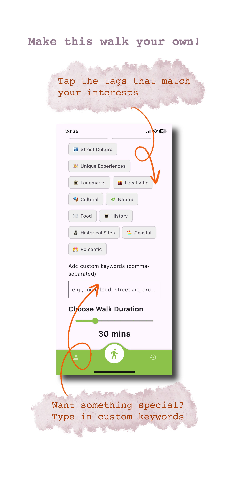
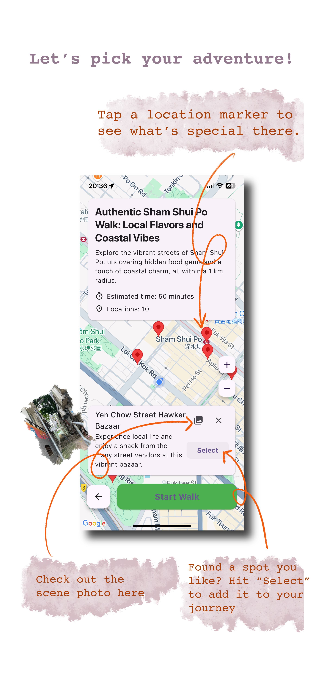
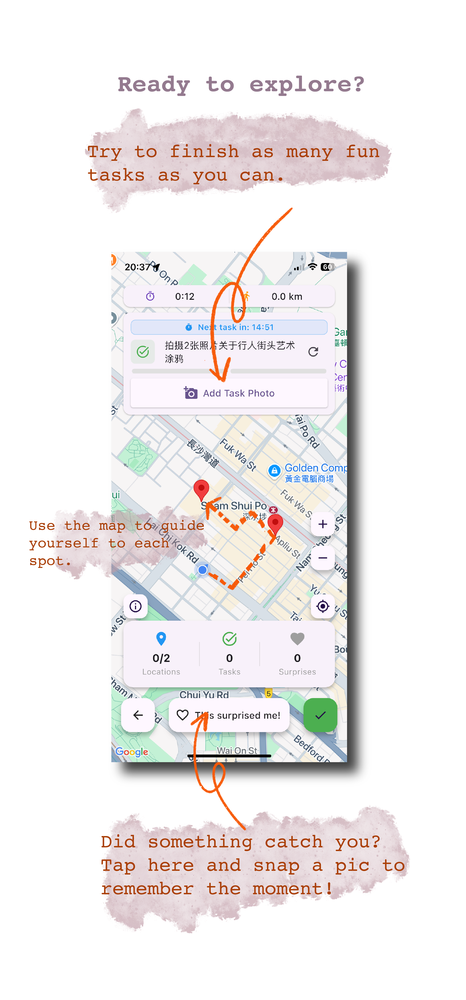

# City Walk

**English** · Flutter package name: `mambo`

A walking app, not a map with pins. Pick a few keywords and how long you have; City Walk generates a route you actually walk — GPS on Google Maps, tasks at each stop, photo logs, and a scrapbook when you get home.

The UI is Chinese-first (`zh_CN`). Keywords are written for a Hong Kong walk.

<p align="center">
  
  
  
</p>

<p align="center">
  <em>In-app tutorial (English slides). The rest of the app is Chinese-first.</em>
</p>

## How a walk works

1. **Setup** — choose keywords (street culture, food, landmarks, nature, …) and a duration in minutes. Custom tags are comma-separated.
2. **Preview** — the generated walk lands on Google Maps. Drop stops that are wrong for *this* afternoon before you commit. Distances are walking (Haversine), not driving.
3. **Walk** — live location, per-stop tasks, camera evidence, GPT verification when a task asks you to find something.
4. **Log** — GPS crumbs, reflections, and a generated scrapbook image. History and favourites live on the same account.

Closing the app mid-walk does not lose it. Home shows an in-progress card you can resume.

Bottom nav: **profile** · **new walk** (centre) · **history**.

## Screenshots

| Tutorial 1 | Tutorial 2 | Tutorial 3 |
| --- | --- | --- |
|  |  |  |

The scrapbook asset used after a walk:

<p align="center">
  
</p>

## Prerequisites

- [Flutter](https://docs.flutter.dev/get-started/install) **3.29+** (Dart SDK `^3.7.0`)
- Xcode (iOS) or Android Studio / an Android device-emulator
- A **Google Maps** API key with Maps SDK for Android / iOS enabled
- A **Supabase** project (auth)
- A **GraphQL** API that implements the walk/log mutations the app calls
- **Cloudinary** (image upload). ImgBB is a fallback if Cloudinary fails

## Setup

```bash
git clone https://github.com/lvyin1122/city_walk.git
cd city_walk
flutter pub get
```

### 1. Environment file

Create `.env` in the project root (same folder as `pubspec.yaml`):

```env
SUPABASE_URL=
SUPABASE_ANON_KEY=
GRAPHQL_ENDPOINT=
CLOUDINARY_CLOUD_NAME=
CLOUDINARY_UPLOAD_PRESET=
IMGBB_API_KEY=
```

`pubspec.yaml` already lists `.env` under `assets:` so `flutter_dotenv` can load it. Do not commit real keys.

### 2. Google Maps keys

Replace the placeholder keys with your own:

| Platform | File | What to set |
| --- | --- | --- |
| Android | `android/app/src/main/AndroidManifest.xml` | `com.google.android.geo.API_KEY` |
| iOS | `ios/Runner/AppDelegate.swift` | `GMSServices.provideAPIKey("…")` |

Restrict the key to your bundle / application id in Google Cloud Console.

### 3. Run

```bash
flutter run
```

First launch: sign up / sign in (Supabase), then the three tutorial slides, then the home walk setup.

```bash
flutter analyze
flutter test
```

## Permissions the app asks for

Needed for the walk loop, not optional chrome:

- **Location** (when in use + background) — track the route
- **Camera** — task evidence during a walk
- **Photo library** — save summaries and pick images

On iOS these are declared in `ios/Runner/Info.plist`. On Android they are in `AndroidManifest.xml`.

## Project layout

```
lib/
  main.dart                 splash → auth wrapper
  features/auth/            sign in / sign up
  features/home/            setup, keywords, profile, history, tutorial, logs
  features/walk/            preview map, live map, review, summary
  services/                 GraphQL, Supabase, Cloudinary, auth
  theme/                    colours and type
```

## Stack

Flutter · Dart · Google Maps · Supabase Auth · GraphQL · Cloudinary · sqflite (local) · audioplayers

## Backend contract (short)

The client does not embed walk-generation logic. It calls GraphQL, including:

- `generateWalk` / `generateWalkWithGpt` — keywords + duration → walk + locations
- `getLatestInProgressWalk` — resume card on home
- `addWalkCoordinate` / `updateWalkStats` — live tracking
- `verifyTaskWithGpt` — photo/task check
- `addLogEntry`, scrapbook and reflection mutations

Point `GRAPHQL_ENDPOINT` at an API that implements those operations or the generate button will fail.

## Notes

- Display name on iOS is still **Mambo**; the product title in Flutter is **CityWalk**.
- Default locale is `zh_CN` (`main.dart`). Tutorial screenshots above are the English asset set.
- An iOS IPA can be built from `.github/workflows/dart.yml` (`workflow_dispatch`).
